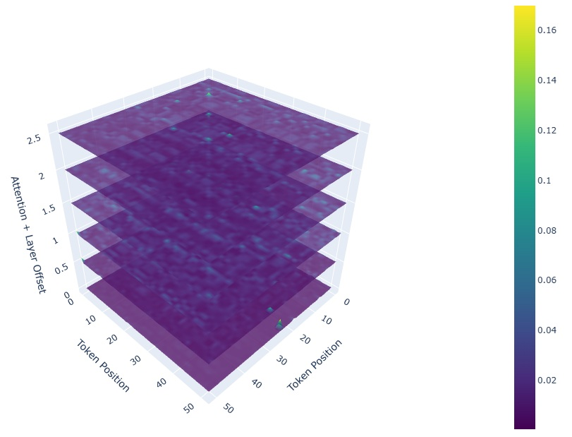

# Visualizing Attention Patterns in Molecular Data

A toolkit for analyzing and visualizing attention mechanisms in transformer models applied to molecular data, providing insights into how models process chemical information and molecular representations.

## Table of Contents

1. [Installation](#installation)
2. [Dataset](#dataset)
3. [Model Architecture](#model-architecture)
4. [Training Pipeline](#training-pipeline)
5. [Visualization Features](#visualization-features)
   - [5.1. Molecular Clustering Analysis](#51-molecular-clustering-analysis)
   - [5.2. 3D Attention Landscape](#52-3d-attention-landscape)
   - [5.3. Attention Focus Analysis](#53-attention-focus-analysis)
   - [5.4. Position-wise Attention Analysis](#54-position-wise-attention-analysis)
   - [5.5. Head Specialization Analysis](#55-head-specialization-analysis)
   - [5.6. Dynamic Attention Flow](#56-dynamic-attention-flow)
6. [Usage](#usage)
7. [Results](#results)
8. [License](#license)
9. [Citation](#citation)
10. [Acknowledgments](#acknowledgments)

---

## Installation

Install the required dependencies using pip:

```bash
pip install -r requirements.txt
```

[↑ Return to Table of Contents](#table-of-contents)

---

## Dataset

This project utilizes the **Open Molecules 2025 (OMol25)** dataset, a collection of molecular structures and properties designed for machine learning applications in computational chemistry.

- **Source**: [Hugging Face Dataset Repository](https://huggingface.co/facebook/OMol25)
- **Content**: Chemical descriptions with associated molecular properties

[↑ Return to Table of Contents](#table-of-contents)

---

## Model Architecture

The core model is built upon **ChemBERTa-zinc-base-v1**, a specialized transformer architecture optimized for chemical data processing:

- **Input**: Chemical descriptions with molecular properties
- **Output**: Language model trained for chemical property prediction and molecular representation learning
- **Architecture**: BERT-based transformer with domain-specific adaptations for molecular data
- **Training Objective**: Dual-purpose model for both property prediction and representation learning

[↑ Return to Table of Contents](#table-of-contents)

---

## Training Pipeline


*Figure 1: Training pipeline showing data preprocessing, model architecture, and optimization steps.*

[↑ Return to Table of Contents](#table-of-contents)

---

## Visualization Features

This toolkit provides comprehensive visualization capabilities for understanding attention patterns in molecular transformer models.

### 5.1. Molecular Clustering Analysis

**UMAP Dimensionality Reduction**: Interactive visualization of molecular embeddings in reduced dimensional space.


*Figure 2: UMAP projection colored by number of atoms, revealing structural patterns in molecular space.*


*Figure 3: Sample molecule clusters formed in UMAP space, demonstrating learned chemical similarities.*

[↑ Return to Table of Contents](#table-of-contents)

### 5.2. 3D Attention Landscape

Three-dimensional visualization combining attention patterns across all model layers and heads.



*Figure 4: Combined attention patterns visualized in three dimensions, showing global attention flow patterns.*

[↑ Return to Table of Contents](#table-of-contents)

### 5.3. Attention Focus Analysis

**Regional Focus Patterns**: Analysis of whether attention heads specialize in different regions of molecular sequences.


*Figure 5: Parallel coordinates plot showing focus patterns across layers and heads.*


*Figure 6: Bar plots comparing attention distribution to beginning, middle, and end regions of molecular sequences.*

[↑ Return to Table of Contents](#table-of-contents)

### 5.4. Position-wise Attention Analysis

**Positional Attention Distribution**: Detailed analysis of how attention is distributed across different positions in molecular formulas.


*Figure 7: Multi-panel analysis showing:*
- *Heatmap of average attention weights by position and layer*
- *Variance plot highlighting positions with variable attention*
- *Entropy plot distinguishing focused vs. diffuse attention patterns*

[↑ Return to Table of Contents](#table-of-contents)

### 5.5. Head Specialization Analysis

**Individual Head Patterns**: Comprehensive analysis of how different attention heads develop specialized functions.


*Figure 8: Grid visualization of attention matrices for each layer-head combination.*


*Figure 9: 3D surface plots revealing attention patterns for selected specialized heads.*

[↑ Return to Table of Contents](#table-of-contents)

### 5.6. Dynamic Attention Flow

**Attention Flow Animation**: Interactive visualization showing relationships between molecular tokens and positions over time.


*Figure 10: Dynamic attention flow animation revealing token-to-token attention relationships.*

**Attention River Plot**: Flow visualization showing attention intensity evolution across model layers.


*Figure 11: River plot visualization tracking attention flow intensity across transformer layers.*

[↑ Return to Table of Contents](#table-of-contents)

---

## Usage

### Basic Attention Visualization

```python
from attention_viz import CombinedAttentionVisualizer

visualizer = CombinedAttentionVisualizer("path/to/attention/maps")
visualizer.run_full_analysis(sample_id="5388")  # or None for auto-detection
```

[↑ Return to Table of Contents](#table-of-contents)

---

## Results

The visualization toolkit provides several key insights into molecular attention patterns:

- **Layer-specific Specialization**: Different transformer layers focus on distinct aspects of molecular structure
- **Position-dependent Attention**: Systematic variations in attention based on token position within molecular sequences
- **Head Specialization**: Individual attention heads develop specialized functions for different chemical features
- **Hierarchical Processing**: Evidence of hierarchical information processing from local to global molecular features

[↑ Return to Table of Contents](#table-of-contents)

---

## License

This project is licensed under the MIT License.

[↑ Return to Table of Contents](#table-of-contents)

---

## Citation

If you use this toolkit in your research, please cite:

```bibtex
@software{molecular_attention_viz,
  title={Visualizing Attention Patterns in Molecular Data},
  author={[Nooshin Bahador]},
  year={2025},
  url={https://github.com/nbahador/attention-visualization-tool}
}
```

[↑ Return to Table of Contents](#table-of-contents)

---

## Acknowledgments

- Facebook AI Research for the OMol25 dataset
- DeepChem community for ChemBERTa model architecture

[↑ Return to Table of Contents](#table-of-contents)
